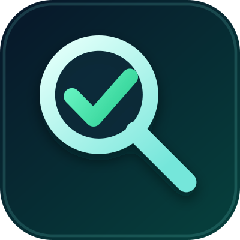
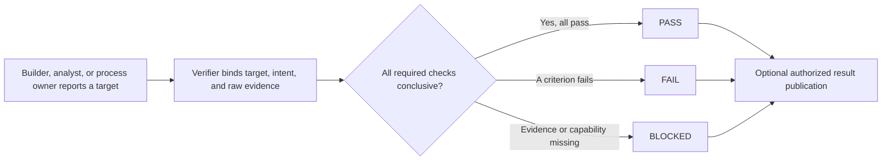

<p align="center">
  
</p>

# Workboard QA Agent

An open-source Codex plugin for independent, evidence-first verification across
completed deliverables, decision-support analysis, and QA processes. It keeps
the target read-only and returns exactly one verdict: `PASS`, `FAIL`, or
`BLOCKED`.



## Point your agent here

Give a Codex agent this prompt:

```text
Read https://github.com/jtcchan/workboard-qa-agent and follow its README to
install the plugin. Start a new task after installation. Then use
$independent-verification to verify the completed work I give you. Keep the
target read-only and return PASS, FAIL, or BLOCKED from raw evidence.
```

## Install manually

```bash
codex plugin marketplace add jtcchan/workboard-qa-agent
codex plugin add workboard-qa-agent@workboard-qa-agent
```

Start a new Codex task after installation so the skill is loaded.

## Run a verification

Provide the verifier with:

- the mode: deliverable, decision, or process;
- the full user intent and what a pass should permit next;
- the target repository, file, URL, issue/comment, account analysis, QA run, or process version;
- immutable identity or a content fingerprint, including the underlying evidence snapshot;
- required and advisory acceptance criteria;
- required verification lanes;
- permitted commands and interactions;
- a local artifact directory; and
- whether result publication is allowed.

Example:

```text
Use $independent-verification to verify PR #42 at commit <SHA>.
Check the changed code, run lint and tests, and inspect the preview at <URL>
on desktop and mobile. Keep the product read-only. Save evidence under
work/qa/pr-42 and return PASS, FAIL, or BLOCKED. Do not publish comments.
```

Decision-analysis example:

```text
Use $independent-verification in decision mode to verify the campaign findings
in issue #16 before any account change. Fingerprint the reviewed issue content,
analysis artifact, raw export/query manifest, account identity, and data range.
Recompute material metrics, test routing and collateral-risk claims, and return
PASS, FAIL, or BLOCKED. A PASS means decision-ready for human review only; it
does not approve or authorize account changes.
```

QA-process example:

```text
Use $independent-verification in process mode to evaluate this QA skill commit
against the supplied completed reports and regression cases. Keep the process
read-only, report observable failure modes, and produce a bounded improvement
packet. Do not edit or self-certify the QA process.
```

## Verification modes and lanes

- Deliverables: completed code, UI, documents, data, and operational state.
- Decisions: analysis, audits, recommendations, and proposed changes before human approval.
- Processes: QA definitions, completed QA runs, and proposed QA-process changes.
- Code: diff, tests, lint, type checks, build, and runtime boundaries.
- Browser and UI: interactions, responsive states, console and network errors.
- Documents: source and rendered pages, content, links, clipping, and layout.
- Data: schema, formulas, counts, transformations, and reconciliation.
- Operations: persisted state, logs, dry runs, and immutable identifiers.

## Workboard is optional

The verifier works without Workboard. Workboard packet fields add optional
routing and result-publication behavior. GitHub or worker comments are written
only when the task explicitly authorizes those exact destinations.

## Safety model

- The verification target stays read-only.
- The verifier must run in a fresh task or thread that did not create or change the target. The same user, model family, or agent implementation is acceptable when execution separation and read-only ownership are recorded.
- Builder summaries and screenshots are hypotheses, not proof.
- Mutable issues, comments, exports, and account data require content/evidence fingerprints.
- Missing required evidence produces `BLOCKED`, not a weaker pass.
- Failed criteria produce `FAIL`; the verifier never silently repairs them.
- Decision-mode `PASS` means decision-ready, not approved or authorized.
- QA-process improvements require a separate builder task and a fresh verifier task.
- Local evidence is not published unless the task explicitly permits it.

## Development

```bash
python3 ~/.codex/skills/.system/skill-creator/scripts/quick_validate.py \
  plugins/workboard-qa-agent/skills/independent-verification
python3 ~/.codex/skills/.system/plugin-creator/scripts/validate_plugin.py \
  plugins/workboard-qa-agent
```

For process changes, also run the behavior-based corpus in
[process evaluation](plugins/workboard-qa-agent/skills/independent-verification/references/process-evaluation.md).
Test observable verdicts, evidence, and side effects; do not treat expected
instruction wording as behavioral proof.

## License

[MIT](LICENSE)
