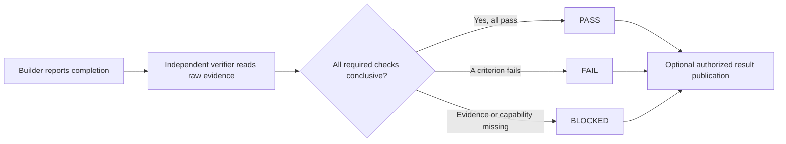

# Workboard QA Agent

An open-source Codex plugin for independent, evidence-first verification.
It checks completed work without repairing it, then returns exactly one verdict:
`PASS`, `FAIL`, or `BLOCKED`.



## Point your agent here

Give a Codex agent this prompt:

```text
Read https://github.com/jtcchan/workboard-qa-agent and follow its README to
install the plugin. Start a new task after installation. Then use
$independent-verification to verify the completed work I give you. Keep the
target read-only and return PASS, FAIL, or BLOCKED from raw evidence.
```

## Install manually

```bash
codex plugin marketplace add jtcchan/workboard-qa-agent
codex plugin add workboard-qa-agent@workboard-qa-agent
```

Start a new Codex task after installation so the skill is loaded.

## Run a verification

Provide the verifier with:

- the target repository, file, URL, or artifact;
- immutable identity when relevant, such as a commit SHA or exact file path;
- acceptance criteria;
- required verification lanes;
- permitted commands and interactions;
- a local artifact directory; and
- whether result publication is allowed.

Example:

```text
Use $independent-verification to verify PR #42 at commit <SHA>.
Check the changed code, run lint and tests, and inspect the preview at <URL>
on desktop and mobile. Keep the product read-only. Save evidence under
work/qa/pr-42 and return PASS, FAIL, or BLOCKED. Do not publish comments.
```

## Verification lanes

- Code: diff, tests, lint, type checks, build, and runtime boundaries.
- Browser and UI: interactions, responsive states, console and network errors.
- Documents: source and rendered pages, content, links, clipping, and layout.
- Data: schema, formulas, counts, transformations, and reconciliation.
- Operations: persisted state, logs, dry runs, and immutable identifiers.

## Workboard is optional

The verifier works without Workboard. Workboard packet fields add optional
routing and result-publication behavior. GitHub or worker comments are written
only when the task explicitly authorizes those exact destinations.

## Safety model

- The verification target stays read-only.
- Builder summaries and screenshots are hypotheses, not proof.
- Missing required evidence produces `BLOCKED`, not a weaker pass.
- Failed criteria produce `FAIL`; the verifier never silently repairs them.
- Local evidence is not published unless the task explicitly permits it.

## Development

```bash
python3 ~/.codex/skills/.system/skill-creator/scripts/quick_validate.py \
  plugins/workboard-qa-agent/skills/independent-verification
python3 ~/.codex/skills/.system/plugin-creator/scripts/validate_plugin.py \
  plugins/workboard-qa-agent
```

## License

[MIT](LICENSE)
